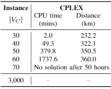

# Region-focused Memetic Algorithms with Smart Initialisation for Real-world Large-scale Waste Collection Problems

This repository is the official **Cplex** implementation of [Region-focused Memetic Algorithms with Smart Initialisation for Real-world Large-scale Waste Collection Problems](https://ieeexplore.ieee.org/abstract/document/9594087). 

>📋  Bibtex entry [m3cvrp.bib](m3cvrp.bib)

## Requirements

To install requirements:

```setup
pip install -r requirements.txt
```

>📋  This code is implemented in Ubuntu 18.04.4 LTS with Python 3.7.7 environment. The installation details  of docplex is in [Here](https://blog.csdn.net/qq_37787732/article/details/107969026?spm=1001.2014.3001.5501). This is a Chinese documentation:)

## Results

Our model achieves the following performance on [self-generated datasets](/dataset):

>

